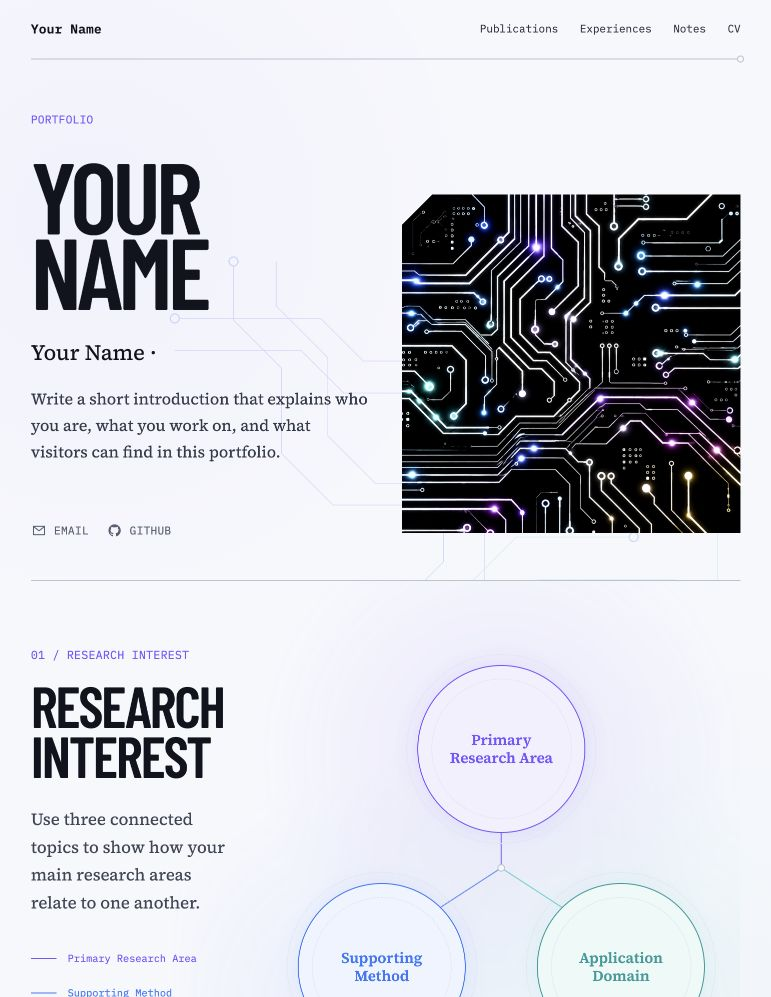
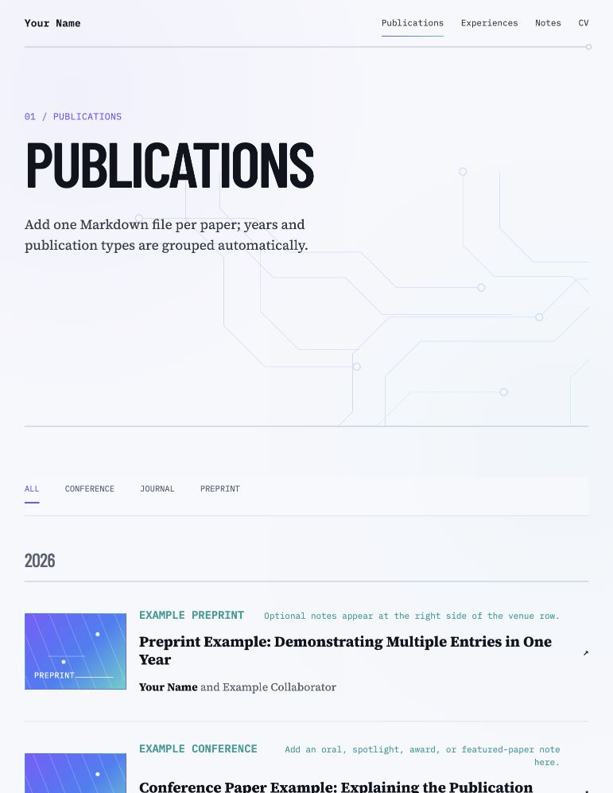
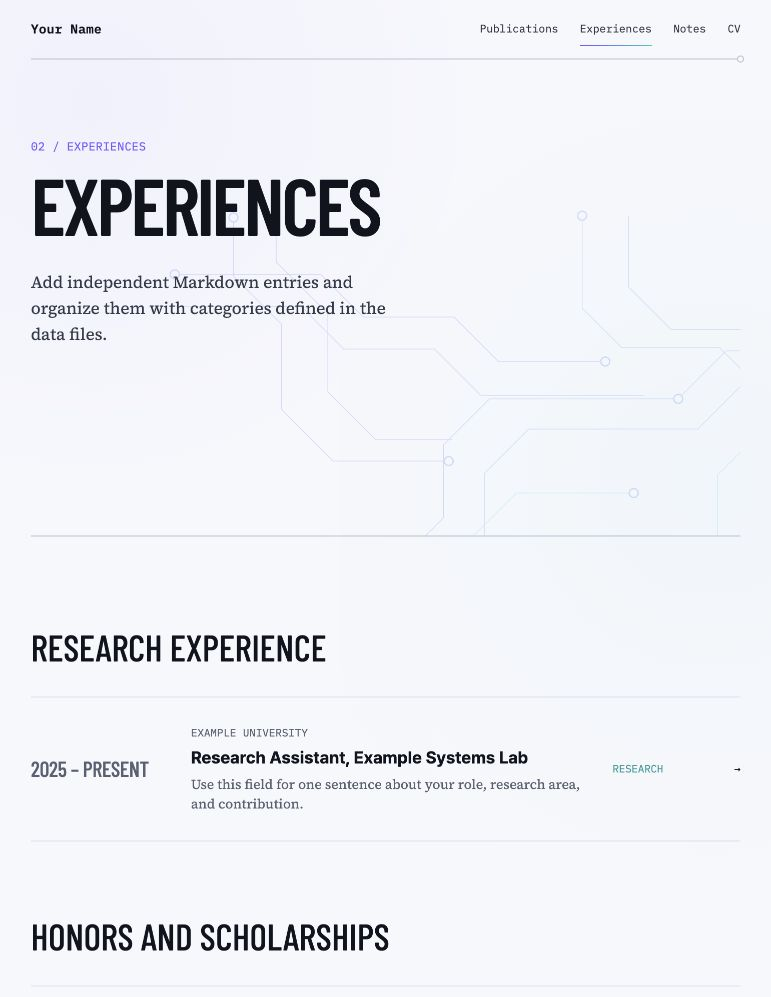
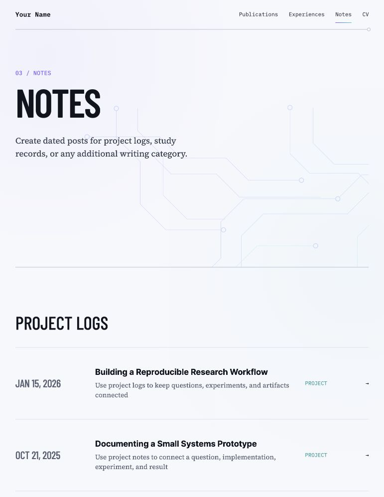
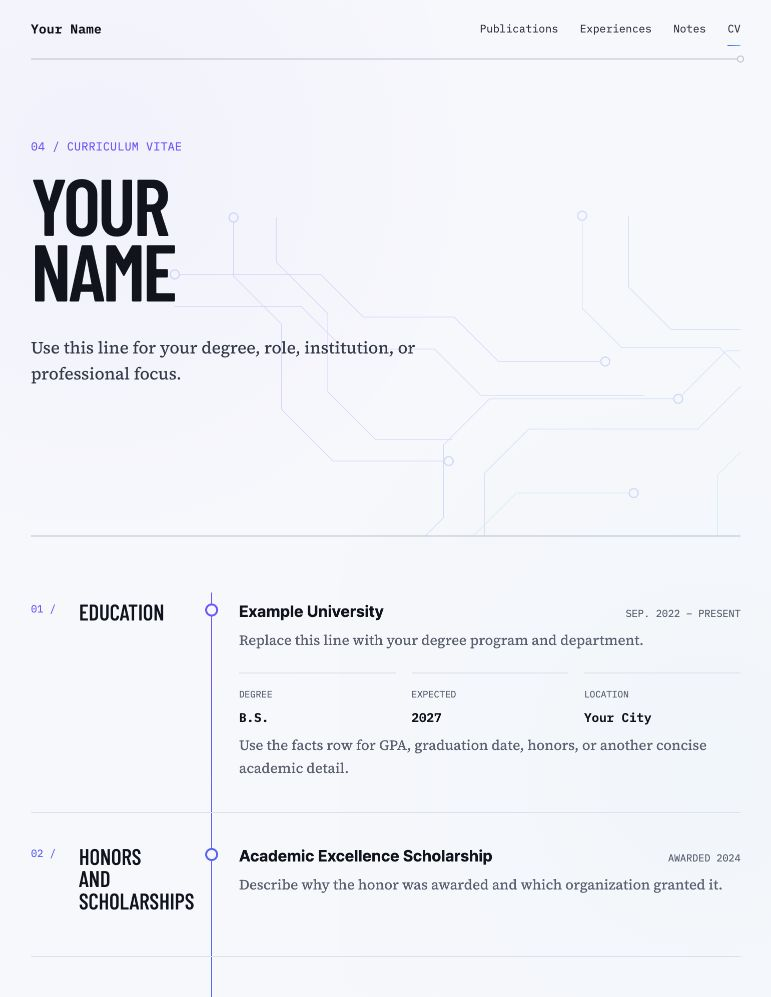

# Signal Academic Portfolio

A light, interactive academic portfolio template for researchers, students, and engineers. It is built with Jekyll and deploys to GitHub Pages.

Every visible person, institution, lab, project, and publication in this repository is neutral example content. The examples are written to explain what each field is for rather than represent a real person or real work.

## Features

- Responsive academic portfolio with violet, blue, and cyan accents
- Interactive three-node research-interest map
- Markdown-driven experiences, publications, and notes
- Automatic category grouping for experiences and notes
- Automatic year grouping and type filtering for publications
- Collection-aware detail pages and back links
- Keyboard-accessible navigation and interactions

## Preview

### Home



<table>
  <tr>
    <td></td>
    <td></td>
  </tr>
  <tr>
    <td align="center"><strong>Publications</strong></td>
    <td align="center"><strong>Experiences</strong></td>
  </tr>
  <tr>
    <td></td>
    <td></td>
  </tr>
  <tr>
    <td align="center"><strong>Notes</strong></td>
    <td align="center"><strong>CV</strong></td>
  </tr>
</table>

## Use this template

1. Click **Use this template** on GitHub.
2. Create `<username>.github.io` for a user site, or choose any repository name for a project site.
3. Replace the placeholder values in `_config.yml`:

```yaml
url: "https://<username>.github.io"
baseurl: "" # use "/<repository>" for a project site
repository: "<username>/<repository>"

author:
  email: "you@example.com"
  github: "<username>"
  cv_pdf: "/assets/your-cv.pdf"
```

4. Replace the neutral examples described below.
5. In **Settings → Pages**, select **GitHub Actions** as the source.

## What to edit

- `_data/profile.yml`: display name, introduction, hero artwork, and three research-interest labels
- `_data/content_groups.yml`: category slugs, labels, and group headings for Experiences and Notes
- `_experiences/*.md`: one Markdown file per experience, award, or other milestone
- `_posts/*.md`: one dated Markdown file per project log or study note
- `_publications/*.md`: one Markdown file per publication
- `_pages/cv.md`: detailed CV sections
- `assets/example-cv.pdf`: replace the downloadable neutral CV example with your own PDF
- `images/profile.png`: hero artwork or profile image

The home-page cells and archive pages are generated from those sources. Adding content normally does not require copying or editing HTML.

### Add an experience

```yaml
---
title: "Research Assistant, Example Lab"
date: 2026-01-01
period: "2026 – Present"
category: "research"
organization: "Example University"
summary: "One concise sentence describing the role and contribution."
link: "/cv/#research-experience"
---
```

The `category` value must match an `experiences` slug in `_data/content_groups.yml`. The included examples demonstrate research, teaching, service, and honors groups. Entries with the same category are grouped automatically.

### Add a note

Create a dated file under `_posts/`:

```yaml
---
layout: single
title: "A Reproducible Research Workflow"
subtitle: "A short description shown in the archive cell"
categories: [project]
---
```

The first category selects the group and label defined under `notes` in `_data/content_groups.yml`. The included examples cover project logs, study records, tutorials, and research reflections.

### Add a publication

```yaml
---
layout: single
title: "Your Paper Title"
date: 2026-01-01
type: "conference"
venue: "Conference or Journal"
paperurl: "https://example.com/paper"
highlight: "Optional oral, spotlight, award, or featured-paper note"
thumbnail_label: "PAPER"
primary_author: "Your Name"
authors:
  - "Your Name"
  - "Coauthor Name"
---
```

Publications are sorted by `date`, grouped under automatically generated year headings, and filterable by `conference`, `journal`, or `preprint`. The complete cell links to `paperurl`; if it is omitted, the generated detail page is used.

## Run locally

Ruby 3.3 or newer is recommended.

```bash
bundle install
bundle exec jekyll serve
```

Open `http://localhost:4000`. For a project site, keep the configured `baseurl` when checking links.

## Before publishing

- Replace `Your Name`, example contact details, and placeholder repository URLs.
- Replace or remove every example Markdown entry.
- Replace `images/profile.png` if you do not want the included circuit artwork.
- Replace `assets/example-cv.pdf` and update `author.cv_pdf` in `_config.yml`; remove the setting if you do not want a download button.
- Confirm that every image, PDF, font, and publication asset you add may be redistributed.

## License and attribution

Signal Academic Portfolio is released under the MIT License. Upstream attribution for Academic Pages and Minimal Mistakes is retained in `LICENSE` and `THIRD_PARTY_NOTICES.md`.
